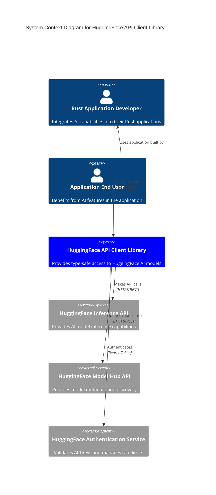
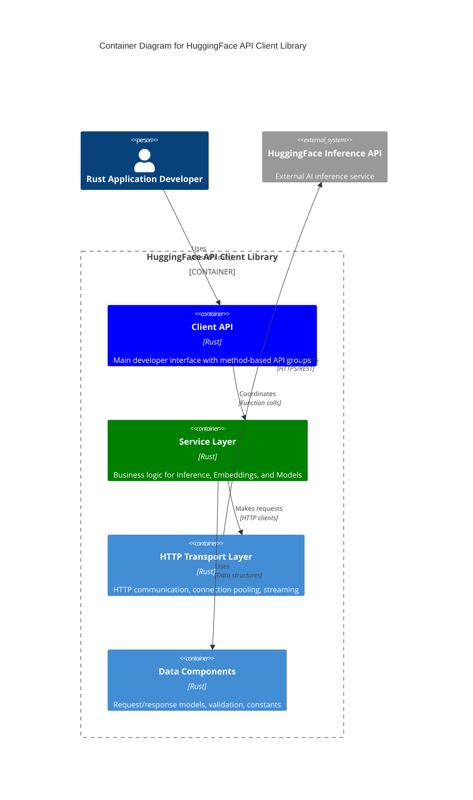
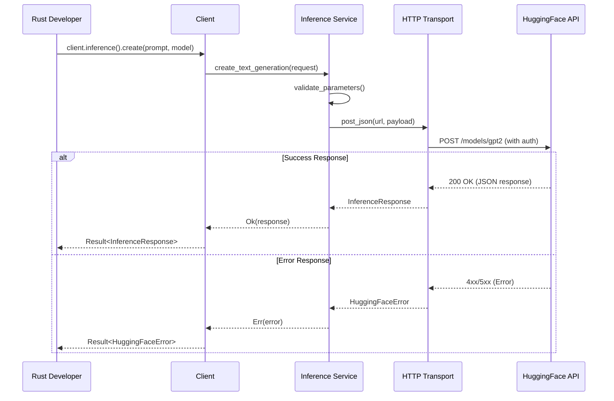
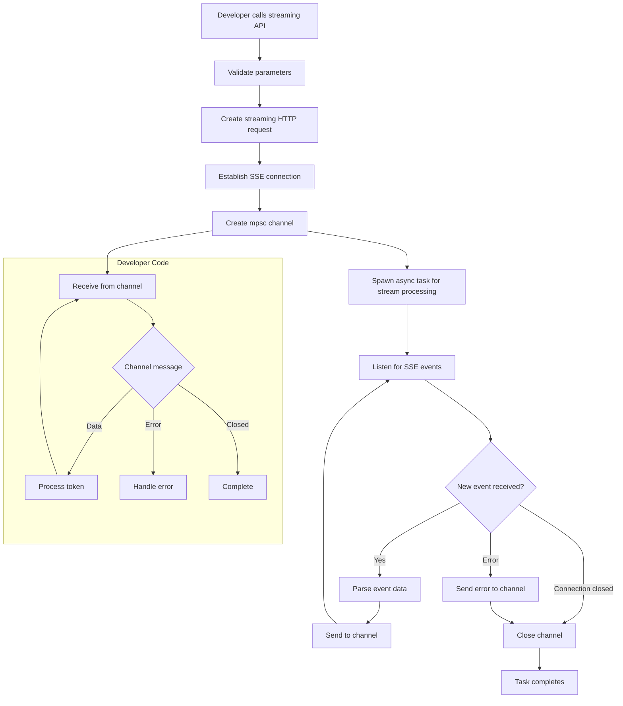
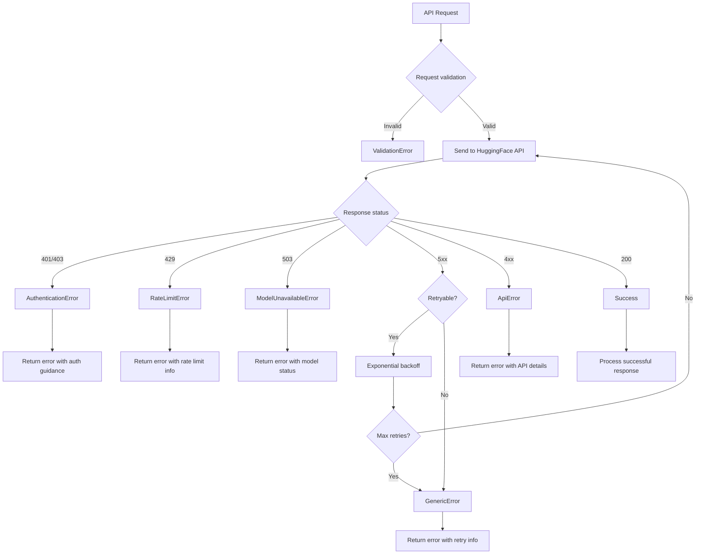

# spec

- **Name:** api_huggingface
- **Version:** 0.2.0
- **Date:** 2024-11-07
- **Status:** Production Ready
- **System Specification:** [../../spec.md](../../spec.md)

### Project Goal

Create a comprehensive, type-safe Rust client library that provides seamless access to HuggingFace's Inference API, enabling developers to integrate state-of-the-art language models and embeddings into their Rust applications with minimal friction and maximum reliability.

**Architecture Decision**: This API crate is designed as a **stateless HTTP client** with no persistence requirements. All operations are direct HTTP calls to the HuggingFace API without local data storage, caching, or state management beyond request/response handling.

**Design Philosophy**: **"Thin Client, Rich API"** - Provide comprehensive, production-ready features that are opt-in via cargo features and require explicit developer configuration. No automatic behaviors occur without explicit setup. All enterprise features (circuit breakers, rate limiting, failover, health checks, caching, performance monitoring, dynamic configuration) are explicitly configured and controlled by the developer.

**Note:** This specification must be implemented in accordance with the ecosystem-wide requirements defined in the [System Specification](../../spec.md).

### Router API Migration (Architectural Decision Record)

**Date**: 2025-09 | **Status**: Completed | **Tasks**: 596-598, 615-623

#### Context

The original implementation used HuggingFace's legacy Inference API (`api-inference.huggingface.co/models/{model}`) which had critical limitations preventing access to modern conversational AI models.

#### Problem

**Legacy Inference API Limitations:**

1. **No Pro Models**: Free tier only - no access to Llama-3, Mistral, CodeLlama
2. **Fallback to BART**: Chat requests would fallback to `facebook/bart-large-cnn` (a summarization model, not a chat model)
3. **No Proper Chat Format**: Required manual prompt engineering instead of structured message history with roles
4. **Deprecated Authentication**: Used non-standard header format

**Impact**: The library couldn't provide access to state-of-the-art conversational models, severely limiting its usefulness for modern AI applications.

#### Decision

Migrate to HuggingFace Router API (`router.huggingface.co/v1/chat/completions`) which provides OpenAI-compatible chat completions interface.

#### Implementation Changes

**URL Structure:**
```
OLD: POST https://api-inference.huggingface.co/models/{model}
NEW: POST https://router.huggingface.co/v1/chat/completions
```

**Authentication:**
```
OLD: X-API-Key: {token}
NEW: Authorization: Bearer {token}
```

**Request Format:**
```rust
// OLD (Inference API)
{
  "inputs": "prompt text",
  "parameters": { "temperature": 0.7, ... }
}

// NEW (Router API)
{
  "model": "moonshotai/Kimi-K2-Instruct-0905:groq",
  "messages": [
    {"role": "system", "content": "You are helpful"},
    {"role": "user", "content": "Hello"}
  ],
  "temperature": 0.7,
  "max_tokens": 150
}
```

**Default Model Selection:**
```
OLD: facebook/bart-large-cnn (summarization)
NEW: moonshotai/Kimi-K2-Instruct-0905:groq (chat)
```

#### Consequences

**Positive:**
- ✅ Access to Pro plan models (Llama-3, Mistral, CodeLlama, Kimi-K2)
- ✅ Proper multi-turn conversations with role-based messages
- ✅ OpenAI-compatible API format (industry standard)
- ✅ Better reliability and dedicated chat endpoints
- ✅ Explicit model selection per request (no fallbacks)

**Negative:**
- ❌ Breaking API change (different request/response format)
- ❌ Requires Pro plan subscription for access
- ❌ All examples needed updating to new format
- ❌ Legacy Inference API examples became obsolete

**Mitigation:**
- Version bumped to 0.2.0 (breaking change semver)
- All examples systematically updated (Tasks 617-623)
- Documentation updated to reflect Router API as primary interface
- Legacy Inference API support dropped to avoid maintaining two interfaces

#### Lessons Learned

1. **API Evaluation**: Always verify API tier limitations before choosing endpoints
2. **Breaking Changes**: Clean breaks (with version bump) better than maintaining dual interfaces
3. **Test Coverage**: Comprehensive tests caught all format incompatibilities during migration
4. **Documentation**: Examples are critical for communicating breaking changes to users

### Vocabulary

- **API Client**: Comprehensive, type-safe Rust client library for HuggingFace Inference API
- **Inference**: Process of generating text completions or responses using pre-trained language models
- **Embedding**: Numerical vector representation of text that captures semantic meaning
- **Model Identifier**: String that uniquely identifies a specific model on HuggingFace platform
- **Inference Parameters**: Configuration options controlling text generation behavior (temperature, max tokens, etc.)
- **Streaming Response**: Real-time delivery of generated text as it's produced for responsive UX
- **Feature Extraction**: Process of converting input text into embeddings using transformer models
- **Rate Limiting**: HuggingFace mechanism for controlling API usage and ensuring fair access
- **Model Loading**: Process of initializing a model on HuggingFace infrastructure before inference
- **Authentication Token**: Secret API key granting access to HuggingFace inference endpoints
- **Similarity Score**: Numerical measure (cosine similarity) indicating semantic similarity between embeddings

### Problem Solved

Rust developers currently lack a robust, well-designed client library for accessing HuggingFace's powerful AI inference capabilities. While HuggingFace provides REST APIs, developers must manually handle HTTP communication, error management, authentication, response parsing, and streaming—creating significant barriers to adoption and increasing the likelihood of implementation errors. This library eliminates these barriers by providing a clean, idiomatic Rust interface that handles all the complexity while maintaining type safety and performance.

### Vision & Scope

### Vision
To be the definitive Rust client library for HuggingFace API integration, providing developers with a reliable, efficient, and enjoyable experience when building AI-powered applications.

### In Scope (Current Implementation)

**Core APIs** (Implemented):
- **Text Generation API**: Complete support for HuggingFace's text generation endpoints with streaming capabilities
- **Embeddings API**: Full support for text embedding generation and similarity calculations
- **Model Management API**: Model discovery, availability checking, and status monitoring
- **Inference Providers API**: Pro plan models (Llama-3, Mistral, CodeLlama) via chat completions endpoint
- **Authentication Management**: Secure API key handling with workspace_tools secret management
- **Error Handling**: Comprehensive error types with detailed categorization and recovery guidance
- **Async Support**: Full async/await compatibility with Tokio runtime integration
- **Type Safety**: Strong typing for all API interactions with compile-time validation
- **Configuration Management**: Flexible environment configuration
- **Documentation**: Complete API documentation with examples and integration guides

### Out of Scope (Never to be Implemented)
- **Model Training**: This library focuses on inference, not training capabilities
- **File Upload/Download**: Limited to text-based API interactions, not file management
- **Real-time Collaboration**: No support for collaborative editing or shared sessions
- **Custom Model Hosting**: Only supports models available through HuggingFace's hosted inference
- **GraphQL Support**: REST API only, no GraphQL interface

**Enterprise Features** (Tier 2 - Production Ready):
- ✅ **Circuit Breakers**: Opt-in failure detection and recovery (explicit developer control)
- ✅ **Rate Limiting**: Token bucket rate limiting with per-second/minute/hour windows (explicit)
- ✅ **Failover**: Multi-endpoint failover with strategies (Priority, RoundRobin, Random, Sticky)
- ✅ **Health Checks**: Background endpoint health monitoring (explicit opt-in)
- ✅ **Dynamic Configuration**: Runtime config updates with watchers and rollback
- ✅ **Performance Metrics**: Request latency, throughput, error rate tracking
- ✅ **Caching**: LRU caching with TTL and statistics (explicit opt-in)
- ✅ **Token Counting**: Token estimation with multiple strategies
- ✅ **Sync API**: Blocking synchronous wrappers for non-async contexts

**Multimodal Features** (Tier 2 - Production Ready):
- ✅ **Vision - Classification**: Image classification with confidence scores
- ✅ **Vision - Detection**: Object detection with bounding boxes
- ✅ **Vision - Captioning**: Image-to-text caption generation
- ✅ **Audio - ASR**: Automatic speech recognition (transcription)
- ✅ **Audio - TTS**: Text-to-speech generation
- ✅ **Audio - Classification**: Audio classification
- ✅ **Audio - Transformation**: Audio-to-audio (noise reduction, enhancement)

**Note**: All enterprise and multimodal features are **opt-in via cargo features** and require explicit developer configuration. No automatic behaviors occur without explicit setup.

### Future Scope Expansion (Prioritized)

**Current API Coverage**: 3 of 48+ HuggingFace Inference API endpoints (6.25%)

If full API coverage is desired, the following expansion priorities are recommended:

**IMPLEMENTED** (Vision & Audio - Tier 2):
- ✅ **Computer Vision - Core APIs** (3 of 5 endpoints):
  - ✅ Image Classification (`POST /models/{model}/image-classification`)
  - ✅ Object Detection (`POST /models/{model}/object-detection`)
  - ✅ Image-to-Text (Image Captioning) (`POST /models/{model}/image-to-text`)
  - ❌ Text-to-Image (`POST /models/{model}/text-to-image`) - Not Implemented
  - ❌ Image Segmentation (`POST /models/{model}/image-segmentation`) - Not Implemented

- ✅ **Audio APIs** (4 of 4 endpoints):
  - ✅ Automatic Speech Recognition (`POST /models/{model}/automatic-speech-recognition`)
  - ✅ Text-to-Speech (`POST /models/{model}/text-to-speech`)
  - ✅ Audio Classification (`POST /models/{model}/audio-classification`)
  - ✅ Audio-to-Audio (`POST /models/{model}/audio-to-audio`)

**MEDIUM PRIORITY** (Specialized Use Cases)

- **Multimodal APIs** (3 endpoints):
  - Visual Question Answering (`POST /models/{model}/visual-question-answering`)
  - Document Question Answering (`POST /models/{model}/document-question-answering`)
  - Image-Text-to-Text (`POST /models/{model}/image-text-to-text`)

**LOW PRIORITY** (Advanced/Niche):
- **Computer Vision - Advanced** (15 endpoints):
  - Depth Estimation, Keypoint Detection, Mask Generation
  - Video Classification, Video-to-Video, Image-to-Video
  - Zero-Shot Image/Object Detection
  - Text-to-3D, Image-to-3D
  - Unconditional Image Generation

- **Additional NLP** (8 endpoints):
  - Fill-Mask, Zero-Shot Classification
  - Sentence Similarity, Text Ranking
  - Table Question Answering
  - Tabular Classification/Regression
  - Conversational (legacy format)

- **Infrastructure Management** (12 endpoints):
  - Dedicated Inference Endpoint lifecycle (`api.endpoints.huggingface.cloud`)
  - Create/Update/Delete/Pause/Resume operations
  - Health checks, logs, metrics, scale-to-zero

**Expansion Effort Estimate**:
- Each HIGH priority API: ~1-2 days (similar complexity to current implementations)
- Each MEDIUM priority API: ~2-3 days (requires multimodal data handling)
- Each LOW priority API: ~1-3 days (varies by complexity)
- Infrastructure Management: ~1 week (different authentication/endpoint structure)

**Total Effort for Complete Coverage**: ~8-12 weeks of development + testing

### Ubiquitous Language (Vocabulary)

**API Client**: The main library interface that coordinates all interactions with HuggingFace services.

**Environment**: A configuration object that encapsulates API credentials, base URLs, and other connection parameters.

**Inference**: The process of generating text completions or responses using a pre-trained language model.

**Embedding**: A numerical vector representation of text that captures semantic meaning for similarity comparisons and retrieval applications.

**Model Identifier**: A string that uniquely identifies a specific model on HuggingFace (e.g., "microsoft/DialoGPT-medium").

**Inference Parameters**: Configuration options that control text generation behavior, such as temperature, max tokens, and sampling settings.

**Streaming Response**: Real-time delivery of generated text as it's produced, allowing for responsive user experiences.

**Feature Extraction**: The process of converting input text into embeddings using transformer models.

**API Error**: A structured error response from HuggingFace services that includes error codes, messages, and recovery guidance.

**Rate Limiting**: HuggingFace's mechanism for controlling API usage to ensure fair access and prevent abuse.

**Model Loading**: The process of initializing a model on HuggingFace's infrastructure before it can accept inference requests.

**Authentication Token**: A secret API key that grants access to HuggingFace's inference endpoints.

**Similarity Score**: A numerical measure (typically cosine similarity) indicating how semantically similar two text embeddings are.

### Success Metrics

- **Developer Adoption**: Achieve 1,000+ downloads within 3 months of initial release
- **API Coverage**: Support core HuggingFace Inference APIs (text generation, embeddings, model management, inference providers)
- **Performance**: Maintain API response handling overhead under 5ms for non-streaming requests
- **Reliability**: Achieve 99.9% success rate for properly formatted API calls (excluding HuggingFace service outages)
- **Documentation Quality**: Maintain comprehensive examples and documentation with zero gaps in public API coverage
- **Error Handling**: Provide actionable error messages for 100% of possible API error scenarios
- **Integration Success**: Enable developers to complete basic integration (authentication + first API call) in under 10 minutes

### System Actors

**Rust Application Developer**: The primary user who integrates this library into their Rust applications to add AI capabilities. They need clear APIs, comprehensive error handling, and excellent documentation.

**HuggingFace Inference API**: The external service that provides the actual AI model inference capabilities. This actor responds to HTTP requests with JSON data or streaming text.

**HuggingFace Model Repository**: The external system that hosts model metadata, availability status, and configuration information.

**Authentication Service**: HuggingFace's authentication system that validates API keys and manages rate limiting.

**Rust Application End User**: The final user of applications built with this library, who benefits from AI-powered features but doesn't directly interact with the library.

### User Stories & Journeys

### Primary Developer Journey: First Integration

**US-1**: As a **Rust Application Developer**, I want to authenticate with HuggingFace using my API key loaded from the workspace `secret` directory so that I can access their inference services securely.

**US-2**: As a **Rust Application Developer**, I want to generate text completions from a language model so that I can add AI-powered text generation to my application.

**US-3**: As a **Rust Application Developer**, I want to receive streaming text responses so that I can provide real-time feedback to my users during text generation.

**US-4**: As a **Rust Application Developer**, I want to generate text embeddings so that I can implement semantic search and similarity matching features.

**US-5**: As a **Rust Application Developer**, I want to check if a model is available and loaded so that I can handle model loading delays gracefully.

### Advanced Developer Journey: Production Integration

**US-6**: As a **Rust Application Developer**, I want to configure custom inference parameters (temperature, max tokens, etc.) so that I can fine-tune the model behavior for my specific use case.

**US-7**: As a **Rust Application Developer**, I want to handle API errors with specific error types so that I can implement appropriate retry logic and user feedback.

**US-8**: As a **Rust Application Developer**, I want to calculate similarity scores between text embeddings so that I can implement recommendation and matching features.

**US-9**: As a **Rust Application Developer**, I want to set custom base URLs and timeouts so that I can adapt the client for different deployment environments.

**US-10**: As a **Rust Application Developer**, I want to batch multiple embedding requests so that I can process large datasets efficiently.

### Complete Developer Journey Narrative

A developer begins by installing the library and setting up their HuggingFace API key through environment variables. They create a client instance, which automatically handles authentication and connection setup. For their first integration, they make a simple text generation request, receiving a complete response. As they become more comfortable, they explore streaming responses for better user experience, experiment with different models, and configure custom parameters. Eventually, they integrate embeddings for semantic search features and implement robust error handling for production deployment.

### Functional Requirements

**FR-1**: The system **must** provide a `Client` struct that serves as the main entry point for all API operations.

**FR-2**: The system **must** support workspace-based configuration that loads API keys using workspace_tools fallback chain:
  1. **Workspace secrets file**: `../../secret/-secrets.sh` (Primary)
  2. **Environment variables**: `HUGGINGFACE_API_KEY` (Fallback)
  3. **Runtime**: programmatic setting with validation (Direct)
Integration tests **must** fail hard if API key is missing.

**FR-3**: The system **must** provide text generation functionality that accepts a prompt string and model identifier, returning generated text.

**FR-4**: The system **must** support streaming text generation that delivers tokens in real-time through an async channel or iterator.

**FR-5**: The system **must** provide text embedding generation that converts input text into numerical vectors.

**FR-6**: The system **must** support batch embedding generation for processing multiple texts in a single request.

**FR-7**: The system **must** calculate cosine similarity scores between text embeddings.

**FR-8**: The system **must** provide model availability checking that returns the current status of a specified model.

**FR-9**: The system **must** support custom inference parameters including temperature, max_tokens, top_p, and repetition_penalty.

**FR-10**: The system **must** provide comprehensive error types that categorize failures into Authentication, RateLimit, ModelUnavailable, Validation, and Generic categories.

**FR-11**: The system **must** support custom base URL configuration for different HuggingFace endpoints or proxy servers.

**FR-12**: ~~The system **must** provide built-in retry logic with exponential backoff for transient failures.~~ **REMOVED per Governing Principle** - No automatic retry logic. Developers implement retry at application level with explicit control.

**FR-13**: The system **must** expose model constants for popular models to reduce configuration errors.

**FR-14**: The system **must** validate all request parameters before sending to prevent invalid API calls.

**FR-15**: The system **must** support custom HTTP headers and user agent configuration.

### Non-Functional Requirements

**NFR-1**: **Performance - Response Processing**: The library **must** process successful API responses with less than 5ms of overhead beyond network latency.

**NFR-2**: **Performance - Memory Efficiency**: The library **must** maintain memory usage under 50MB for concurrent handling of up to 100 simultaneous requests.

**NFR-3**: **Performance - Streaming Latency**: Streaming responses **must** deliver the first token within 200ms of receiving it from the HuggingFace API.

**NFR-4**: **Reliability - Error Recovery**: The library **must** successfully retry transient failures (5xx errors, timeouts) with exponential backoff, achieving a 95% success rate for retryable errors.

**NFR-5**: **Reliability - Connection Handling**: The library **must** gracefully handle network interruptions and resume streaming connections without data loss.

**NFR-6**: **Security - Credential Management**: API keys **must** never be logged, cached to disk, or exposed in error messages, using the `secrecy` crate for protection.

**NFR-7**: **Security - TLS Requirements**: All HTTP communication **must** use TLS 1.2 or higher with certificate validation enabled.

**NFR-8**: **Compatibility - Rust Version**: The library **must** compile and function correctly on Rust 1.70.0 and all subsequent stable releases.

**NFR-9**: **Compatibility - Tokio Integration**: The library **must** be fully compatible with Tokio runtime versions 1.0 and higher.

**NFR-10**: **Usability - API Ergonomics**: All primary use cases (authentication, text generation, embeddings) **must** be achievable with fewer than 10 lines of code.

**NFR-11**: **Usability - Error Messages**: Error messages **must** include actionable guidance for resolution, with specific suggestions for common failure scenarios.

**NFR-12**: **Maintainability - Documentation Coverage**: All public APIs **must** have comprehensive documentation with working code examples that pass `cargo test --doc`.

**NFR-13**: **Scalability - Concurrent Requests**: The library **must** support at least 1,000 concurrent requests without performance degradation or resource exhaustion.

**NFR-14**: **Observability - Logging**: The library **must** provide structured logging at appropriate levels (trace, debug, info, warn, error) using the `tracing` crate.

**NFR-15**: **Testing - Coverage**: The library **must** maintain at least 90% code coverage with comprehensive unit and integration tests.

**NFR-16**: **ZERO-TOLERANCE MOCK POLICY** - **STRICTLY FORBIDDEN** to provide any mocking capabilities or testing facilities without real API calls. All testing must use real HuggingFace API endpoints with valid API keys. No mock providers, dummy responses, or simulated behavior allowed.

### Enterprise Features - Opt-In Design (IMPLEMENTED)

**Status**: **PRODUCTION READY** - Tier 2 Features

**Design Philosophy**: All enterprise features are **opt-in via cargo features** and require **explicit developer configuration**. No automatic behaviors occur without explicit setup, maintaining the "Thin Client, Rich API" principle.

### Implemented Features (Tier 2)

The following enterprise features are **fully implemented and production-ready**:

- ✅ **Circuit Breaker Pattern** - Opt-in failure detection with explicit configuration
- ✅ **Rate Limiting** - Token bucket rate limiting (per-second, per-minute, per-hour) with explicit setup
- ✅ **Failover Support** - Multi-endpoint failover with strategies (Priority, RoundRobin, Random, Sticky)
- ✅ **Health Checks** - Background endpoint health monitoring (explicit opt-in)
- ✅ **Dynamic Configuration** - Runtime configuration updates with watchers and rollback
- ✅ **Performance Metrics** - Request latency, throughput, error rate tracking
- ✅ **Caching** - LRU caching with TTL and statistics (explicit opt-in)
- ✅ **Token Counting** - Token estimation with multiple strategies
- ✅ **Sync API** - Blocking synchronous wrappers for non-async contexts

### Alignment with "Thin Client, Rich API" Principle

Enterprise features maintain the governing principle through:

1. **Opt-In Only**: All features require explicit cargo feature flags and developer configuration
2. **No Automatic Behavior**: Features only activate when explicitly configured by the developer
3. **Explicit Control**: Developers must explicitly call methods (e.g., `rate_limiter.acquire().await`)
4. **Information Not Action**: Features provide capabilities; developers decide when to use them
5. **Zero Default State**: No enterprise features are active by default

### Developer Control Model

```rust
// Example: Developer explicitly configures and controls rate limiting
let rate_limiter = RateLimiter::new( config );  // Explicit setup
rate_limiter.acquire().await?;                  // Explicit control
let result = client.inference().create( ... ).await?;
```

All enterprise features follow this explicit control pattern - no magic, no surprises.

### Benefits of Opt-In Design

- **Predictability**: Features only activate when explicitly configured by the developer
- **Simplicity**: No hidden behaviors or automatic decision-making
- **Flexibility**: Developers choose which enterprise features to use (if any)
- **Testability**: Deterministic behavior - features are either on (explicit) or off (default)
- **Performance**: Zero overhead from unused features (pay only for what you use)

### Limitations

**L-1**: **Rate Limiting**: The library is subject to HuggingFace's API rate limits, which vary by subscription tier. Free tier users are typically limited to 1,000 requests per month.

**L-2**: **Model Availability**: Model availability and response times are dependent on HuggingFace's infrastructure. Cold models may require 10-30 seconds to load before first use.

**L-3**: **Request Size Limits**: Individual requests are limited by HuggingFace's payload size restrictions (typically 1MB for text inputs).

**L-4**: **Concurrent Connection Limits**: The library respects standard HTTP connection limits and may queue requests when connection pools are exhausted.

**L-5**: **Network Dependency**: All API functionality requires active internet connectivity to HuggingFace's servers. Opt-in caching features can reduce API calls for repeated requests.

**L-6**: **Model-Specific Limitations**: Each model has specific input/output constraints (context length, supported languages, etc.) that are enforced by HuggingFace's API.

**L-7**: **Async Runtime Requirement**: The core library requires a Tokio runtime. A synchronous API wrapper is available via the `sync` feature for non-async contexts.

**L-8**: **Memory Usage for Large Responses**: Processing very large responses (>100MB) may require significant memory allocation proportional to response size.

**L-9**: **Streaming Interruption Recovery**: If a streaming connection is interrupted after partial data reception, the partial response cannot be recovered or resumed.

**L-10**: **API Version Dependency**: The library is designed for the current HuggingFace Inference API version and may require updates when HuggingFace releases breaking API changes.

### External System Dependencies & Interfaces

### HuggingFace Inference API

**Service Name:** HuggingFace Inference API
**Purpose:** Provides AI model inference capabilities for text generation and embeddings
**API Type:** REST
**Access Method:** Bearer Token Authentication
**Base URL:** `https://api-inference.huggingface.co`

**Required Endpoints/Operations:**
- `POST /models/{model_id}` - Text generation and feature extraction
- `GET /models/{model_id}` - Model metadata and status information
- `POST /models/{model_id}` (with streaming) - Streaming text generation

**Risk Assessment:**
- **Availability:** High dependency on HuggingFace infrastructure. Fallback: Implement circuit breaker pattern with exponential backoff. Service outages directly impact all functionality.
- **Performance:** Response times vary by model size and server load (50ms-5s typical). Mitigation: Implement configurable timeouts, model warm-up detection, and user-facing loading indicators.
- **Security:** Requires secure API key management. All traffic uses HTTPS. Risk: API key exposure in logs or error messages. Mitigation: Use `secrecy` crate for credential protection.
- **Cost:** Usage-based pricing with rate limiting. Risk: Unexpected charges from high usage. Mitigation: Implement client-side rate limiting and usage monitoring guidance.

### HuggingFace Model Hub API

**Service Name:** HuggingFace Model Hub API
**Purpose:** Provides model metadata, availability status, and discovery capabilities
**API Type:** REST
**Access Method:** Public API (some endpoints), Bearer Token (authenticated endpoints)
**Base URL:** `https://huggingface.co/api`

**Required Endpoints/Operations:**
- `GET /models/{model_id}` - Model metadata and configuration
- `GET /models` - Model discovery and search

**Risk Assessment:**
- **Availability:** Lower criticality than inference API. Fallback: Cache model metadata locally, provide static model constants.
- **Performance:** Generally fast response times (<200ms). Impact of outages is limited to model discovery features.
- **Security:** Minimal security requirements for public metadata endpoints.
- **Cost:** Free tier sufficient for most use cases.

### System Architecture (Recommended)

The library is recommended to follow a **layered architecture** with clear separation of concerns, implementing the **Repository pattern** for external API interactions and **Builder pattern** for configuration management.

### Core Architecture Layers

**1. Public API Layer (`Client`)**
- Provides the main developer interface with method-based API groups
- Handles request orchestration and response coordination
- Manages authentication and environment configuration
- Implements the facade pattern to hide internal complexity

**2. Service Layer (`Inference`, `Embeddings`, `Models`)**
- Contains business logic for each API domain
- Handles request validation and parameter processing  
- Manages response transformation and error mapping
- Implements domain-specific retry and circuit breaker logic

**3. HTTP Transport Layer**
- Manages all HTTP communication with HuggingFace APIs
- Handles connection pooling, timeouts, and streaming
- Implements authentication header injection
- Provides generic request/response handling with proper error mapping

**4. Data Layer (`Components`)**
- Defines all request/response data structures
- Handles serialization/deserialization with `serde`
- Provides type-safe parameter validation
- Contains model constants and configuration structures

### Key Architectural Patterns

**Environment Configuration Pattern:**
It is recommended to implement a trait-based environment system that allows for flexible configuration while maintaining type safety. The `HuggingFaceEnvironment` trait should define the contract for API credentials and connection settings, with `HuggingFaceEnvironmentImpl` providing the standard implementation.

**Error Handling Strategy:**
The architecture should implement a hierarchical error system using the `error_tools` crate, with specific error types for different failure categories (Authentication, RateLimit, ModelUnavailable, etc.). Errors should include contextual information and recovery suggestions.

**Async-First Design:**
All API operations should be designed as async functions returning `Result<T, HuggingFaceError>`. The library should use `tokio::mpsc` channels for streaming responses and implement proper backpressure handling.

**Dependency Injection Pattern:**
The `Client` should accept generic environment types, allowing for easy testing and alternative implementations while maintaining strong typing throughout the system.

### Error Handling Strategy

### Error Types
```rust
#[ derive( Debug, Clone, PartialEq ) ]
pub enum HuggingFaceError
{
  Api( ApiError ),           // API-returned errors
  Http( String ),            // HTTP transport errors
  Network( String ),         // Network connectivity issues
  Timeout( String ),         // Request timeout errors
  InvalidArgument( String ), // Client-side validation failures
  Authentication( String ),  // API key issues
  RateLimit( String ),       // Rate limiting errors
  ModelUnavailable( String ), // Model loading issues
}
```

### Integration with error_tools
- Leverage `error_tools` crate for ecosystem consistency
- Automatic derive implementations where possible
- Structured error propagation
- Domain-specific error variants for HuggingFace-specific failures

### Infrastructure Support (Recommended)

Since this is a client library rather than a deployed service, infrastructure requirements are minimal. The library operates within the host application's runtime environment and connects to external HuggingFace services.

### Development & Testing Infrastructure

**Proposal A (Budget Development Setup)**
- **Local Development**: Standard Rust toolchain with cargo for building and testing
- **CI/CD**: GitHub Actions free tier for automated testing and releases
- **Documentation Hosting**: docs.rs for automatic documentation generation and hosting
- **Package Registry**: crates.io for distribution
- **Testing**: Local unit tests plus integration tests against HuggingFace's free tier
- **Monthly Cost**: $0 (utilizing free tiers)

**Proposal B (Enhanced Development Setup)**
- **Local Development**: Same as Proposal A
- **CI/CD**: GitHub Actions with additional runners for comprehensive testing
- **Testing Infrastructure**: Dedicated HuggingFace Pro account for consistent integration testing
- **Monitoring**: Integration with external monitoring for API health checks
- **Performance Testing**: Cloud-based load testing for concurrent request validation
- **Monthly Cost**: ~$20-50 (HuggingFace Pro subscription + additional CI resources)

### Host Application Requirements

**Runtime Dependencies:**
- Tokio async runtime (versions 1.0+)
- Internet connectivity for API access
- TLS support for secure connections

**Resource Recommendations for Host Applications:**
- **Memory**: 50MB+ available for concurrent request handling
- **CPU**: Minimal requirements - I/O bound operations
- **Network**: Stable internet connection with TLS 1.2+ support
- **Storage**: No persistent storage requirements (stateless library)

### Data Stores (Recommended)

The library is designed to be stateless with no persistent data storage requirements. All data flows through memory-based structures during request/response cycles.

### Memory-Based Data Management

**Request/Response Cache**: Temporary in-memory storage for request parameters and response data during processing. Automatically cleaned up after completion.

**Connection Pool**: HTTP connection pool managed by the `reqwest` client for efficient connection reuse.

**Error Context Storage**: Temporary storage of error context and retry state for failed requests.

### No Persistent Storage

The library intentionally avoids persistent storage to maintain simplicity and avoid data management complexities. This design choice means:

- **No Database Requirements**: No SQL or NoSQL databases needed
- **No File System Dependencies**: No configuration files or cache files
- **No State Persistence**: Each client instance starts fresh
- **Stateless Design**: Perfect for serverless and containerized environments

### Internal Data Models (Recommended)

The following data structures represent the recommended internal models for the library's operation:

### Core Request/Response Models

```rust
// Inference Request Model
pub struct InferenceRequest
{
  pub inputs : String,
  pub parameters : Option< InferenceParameters >,
  pub options : Option< RequestOptions >,
}

// Inference Parameters Model
pub struct InferenceParameters
{
  pub temperature : Option< f32 >,
  pub max_new_tokens : Option< u32 >,
  pub top_p : Option< f32 >,
  pub repetition_penalty : Option< f32 >,
  pub do_sample : Option< bool >,
  pub return_full_text : Option< bool >,
}

// Embedding Request Model
pub struct EmbeddingRequest
{
  pub inputs : Vec< String >,
  pub options : Option< RequestOptions >,
}

// Model Status Model
pub struct ModelStatus
{
  pub loaded : bool,
  pub state : ModelState,
  pub compute_type : Option< String >,
  pub framework : Option< String >,
}
```

### Configuration Models

```rust
// Environment Configuration Model
pub struct HuggingFaceConfig
{
  pub api_key : Secret< String >,
  pub base_url : String,
  pub timeout_seconds : u64,
  pub max_retries : u8,
  pub user_agent : String,
}

// Request Options Model
pub struct RequestOptions
{
  pub wait_for_model : Option< bool >,
  pub use_cache : Option< bool >,
}
```

### Response Models

```rust
// Text Generation Response Model
pub struct InferenceResponse
{
  pub generated_text : String,
  pub details : Option< GenerationDetails >,
}

// Embedding Response Model
pub struct EmbeddingResponse
{
  pub embeddings : Vec< Vec< f32 > >,
  pub model : String,
}

// Streaming Response Model
pub struct StreamResponse
{
  pub token : String,
  pub generated_text : Option< String >,
  pub details : Option< StreamDetails >,
}
```

### Architectural & Flow Diagrams (Recommended)

### System Context Diagram

This diagram shows the library as a black box and its external interactions:



### High-Level Architecture Diagram

This diagram shows the internal structure and major components:



### Text Generation Sequence Diagram

This diagram shows the flow for a typical text generation request:



### Streaming Response Activity Diagram

This diagram shows the flow for streaming text generation:



### Error Handling Flow Diagram

This diagram shows the comprehensive error handling strategy:



### Library Integration Diagram

This diagram shows how the library integrates into a typical Rust application:

```mermaid
graph TD
    subgraph "Rust Application"
        A[main.rs] --> B[App Logic]
        B --> C[Feature Module]
        C --> D[API Integration Layer]
    end
    
    subgraph "HuggingFace Client Library"
        D --> E[Client::build()]
        E --> F[Environment Config]
        F --> G[API Groups]
        G --> H[Inference API]
        G --> I[Embeddings API]  
        G --> J[Models API]
    end
    
    subgraph "External Services"
        H --> K[HuggingFace Inference API]
        I --> K
        J --> K
    end
    
    subgraph "Configuration"
        L[Environment Variables] --> F
        M[Custom Config] --> F
    end
```

### Rust Library Design: Granular Feature Gating (Recommended)

The library **must** be designed with an extremely granular feature-gating strategy to allow consumers to opt-in to only the functionality they need, ensuring minimal dependency graphs and optimized compilation times.

### Core Design Principles

**1. Minimal & Lightweight Core**
The default build (with no features enabled) **must** contain only the absolute essential functionality:
- Basic client structure and environment configuration
- Core error types and result handling
- Authentication and HTTP transport foundations
- Essential data structures for API communication

**2. Granular Feature Gating Strategy**
Each distinct piece of functionality **must** be organized into independent features:

```toml
[features]
default = []

# Core API Groups (mutually exclusive functionality)
inference = ["dep:eventsource-stream"]
embeddings = ["dep:nalgebra"] 
models = []

# Inference Sub-Features
inference-streaming = ["inference", "dep:tokio-stream", "dep:futures-util"]
inference-parameters = ["inference"]
inference-retry = ["inference", "dep:backoff"]

# Embedding Sub-Features  
embeddings-similarity = ["embeddings"]
embeddings-batch = ["embeddings"]

# Utility Features
model-constants = []
env-config = ["dep:dotenv"]
logging = ["dep:tracing", "dep:tracing-subscriber"]

# Development and Testing Features
integration-tests = ["inference", "embeddings", "models"]
# mock-client = ["dep:mockall"] # DISABLED - Zero-tolerance mock policy

# Convenience Bundles
basic = ["inference", "embeddings", "models", "env-config"]
full = ["basic", "inference-streaming", "inference-retry", "embeddings-similarity", "embeddings-batch", "model-constants", "logging"]

# Enable all features (for development and comprehensive testing)
enabled = ["full", "integration-tests"]
```

**3. Feature-Gated Module Structure**
Code organization **must** reflect the feature boundaries:

```rust
// Core (always available)
pub mod client;
pub mod error;
pub mod environment;

// Feature-gated modules
#[ cfg( feature = "inference" ) ]
pub mod inference;

#[ cfg( feature = "embeddings" ) ]
pub mod embeddings;

#[ cfg( feature = "models" ) ]
pub mod models;

#[ cfg( feature = "model-constants" ) ]
pub mod constants;

// Re-exports based on enabled features
#[ cfg( feature = "inference" ) ]
pub use inference::Inference;

#[ cfg( feature = "embeddings" ) ]
pub use embeddings::Embeddings;
```

**4. Conditional API Surface**
The `Client` struct **must** expose methods conditionally based on enabled features:

```rust
impl< E > Client< E >
where E : HuggingFaceEnvironment + EnvironmentInterface
{
  // Always available
  pub fn build( environment : E ) -> Result< Self > { /* ... */ }

  // Conditionally compiled API groups
  #[ cfg( feature = "inference" ) ]
  pub fn inference( &self ) -> Inference< E >
  {
    Inference::new( self )
  }

  #[ cfg( feature = "embeddings" ) ]
  pub fn embeddings( &self ) -> Embeddings< E >
  {
    Embeddings::new( self )
  }

  #[ cfg( feature = "models" ) ]
  pub fn models( &self ) -> Models< E >
  {
    Models::new( self )
  }
}
```

**5. Dependency Feature Alignment**
External dependencies **must** be gated precisely to their usage:

```toml
# HTTP client (always required for core functionality)
reqwest = { workspace = true, features = ["json", "rustls-tls"], default-features = false }

# Streaming dependencies (only with streaming features)
eventsource-stream = { workspace = true, optional = true }
tokio-stream = { workspace = true, optional = true }
futures-util = { workspace = true, optional = true }

# Math dependencies (only with similarity features)
nalgebra = { workspace = true, optional = true }

# Retry logic dependencies
backoff = { workspace = true, optional = true, features = ["tokio"] }

# Environment loading
dotenv = { workspace = true, optional = true }

# Logging infrastructure  
tracing = { workspace = true, optional = true }
tracing-subscriber = { workspace = true, optional = true }

# Testing utilities
# mockall = { workspace = true, optional = true } # DISABLED - Zero-tolerance mock policy
```

### Usage Examples

**Minimal Text Generation Only:**
```toml
[dependencies]
api_huggingface = { version = "0.2.0", features = ["inference"] }
```

**Embeddings with Similarity Calculations:**
```toml
[dependencies] 
api_huggingface = { version = "0.2.0", features = ["embeddings", "embeddings-similarity"] }
```

**Full-Featured Development:**
```toml
[dependencies]
api_huggingface = { version = "0.2.0", features = ["full"] }
```

**Production Optimized (specific needs):**
```toml
[dependencies]
api_huggingface = { version = "0.2.0", features = ["inference", "inference-streaming", "env-config", "logging"] }
```

### Compilation Impact Analysis

This granular approach provides significant benefits:

- **Minimal Core**: ~15 dependencies for basic HTTP client functionality
- **Inference Only**: +3 dependencies for text generation
- **Embeddings with Similarity**: +5 dependencies for vector operations  
- **Full Featured**: All ~35 dependencies only when explicitly requested

**Rationale:** This design allows developers to include only the dependencies they actually use, reducing compile times, binary sizes, and potential security attack surface while maintaining full functionality for those who need it.

### Open Questions

**Q-1**: Should the library provide synchronous wrapper functions for environments that cannot use async/await, or maintain the async-only design for simplicity?

**Q-2**: What level of caching (if any) should be implemented for model metadata to reduce API calls, while maintaining data freshness?

**Q-3**: Should the library include built-in usage tracking and billing estimation features to help developers monitor their API costs?

**Q-4**: How should the library handle HuggingFace API version changes - automatic compatibility detection or explicit version pinning?

**Q-5**: Should custom timeout configurations be global per client instance or configurable per request for maximum flexibility?

**Q-6**: What is the preferred approach for handling very large embedding batch requests - automatic chunking or explicit size limits with clear error messages?

### Core Principles of Development

### 1. Single Source of Truth
The project's Git repository **must** be the absolute single source of truth for all project-related information. This includes specifications, documentation, source code, configuration files, and architectural diagrams. Links to all external project assets (e.g., deployed environments, cloud service consoles, shared data stores) **must** be stored in a central, version-controlled file (e.g., `assets.md`).

### 2. Documentation-First Development
All changes to the system's functionality or architecture **must** be documented in the relevant specification files *before* implementation begins. The workflow is:
1. **Propose:** A change is proposed by creating a new branch and modifying the documentation.
2. **Review:** The change is submitted as a Pull Request (PR) for team review.
3. **Implement:** Implementation work starts only after the documentation PR is approved and merged.

### 3. Review-Driven Change Control
All modifications to the repository, without exception, **must** go through a formal Pull Request review. Each PR **must** have a clear description of its purpose and be approved by at least one other designated reviewer before being merged.

### 4. Radical Transparency and Auditability
The development process **must** be fully transparent and auditable. All significant decisions and discussions **must** be captured in writing within the relevant Pull Request or a linked issue tracker. The repository's history should provide a clear, chronological narrative of the project's evolution.

### 5. File Naming Conventions
All file names within the project repository **must** use lowercase `snake_case`. This ensures consistency and avoids issues with case-sensitive file systems.
- ✅ **Good:** `specification.md`, `user_story_data.csv`, `main_app.py`
- ❌ **Bad:** `Specification.md`, `UserStoryData.csv`, `MainApp.py`

### 6. Test-Driven Development (TDD)
All new functionality, without exception, **must** be developed following a strict Test-Driven Development (TDD) methodology. The development cycle for any feature is:
1. **Red:** Write a failing automated test that verifies a specific piece of functionality.
2. **Green:** Write the minimum amount of production code necessary to make the test pass.
3. **Refactor:** Refactor the code to meet quality standards, ensuring all tests continue to pass.
This principle is non-negotiable and ensures a robust, verifiable, and maintainable codebase.

### 7. Feature-First Architecture
All functionality **must** be organized around cargo features to enable granular consumer control. No functionality should be included in the default build unless it represents core, essential behavior that all users require.

### Deliverables

- **Published Rust Crate**: A fully functional, production-ready crate published to crates.io with semantic versioning
- **Comprehensive API Documentation**: Complete documentation hosted on docs.rs with working examples for all public APIs
- **Source Code Repository**: Full access to the GitHub repository with complete development history and issue tracking
- **Integration Examples**: Working example applications demonstrating common integration patterns
- **Feature Documentation**: Detailed documentation of all cargo features and their dependency impacts

### Stakeholder Changelog

- **v0.2.0 (Current)**: Initial specification creation with comprehensive API coverage and granular feature gating design

### Meta-Requirements

**MR-1**: This specification **must** be maintained as a living document, updated with any changes to requirements or architecture before implementation.

**MR-2**: All code examples within this specification **must** compile and pass tests when the specification is updated.

**MR-3**: The specification **must** be reviewed and approved by the development team before any major implementation milestones.

**MR-4**: Any deviations from this specification during implementation **must** be documented with rationale and approved through the standard review process.

### Appendix: Addendum

### Purpose
This document is intended to be completed by the **Developer** during the implementation phase. It is used to capture the final, as-built details of the **Internal Design**, especially where the implementation differs from the initial `Design Recommendations` in `specification.md`.

### Instructions for the Developer
As you build the system, please use this document to log your key implementation decisions, the final data models, environment variables, and other details. This creates a crucial record for future maintenance, debugging, and onboarding.

---

### Conformance Checklist
*This checklist is the definitive list of acceptance criteria for the project. Before final delivery, each item must be verified as complete and marked with `✅`. Use the 'Verification Notes' column to link to evidence (e.g., test results, screen recordings).*

| Status | Requirement | Verification Notes |
| :--- | :--- | :--- |
| ❌ | **FR-1:** The system **must** provide a `Client` struct that serves as the main entry point for all API operations. | [Link to evidence...] |
| ❌ | **FR-2:** The system **must** support environment-based configuration that loads API keys from the `HUGGINGFACE_API_KEY` environment variable. | [Link to evidence...] |
| ❌ | **FR-3:** The system **must** provide text generation functionality that accepts a prompt string and model identifier, returning generated text. | [Link to evidence...] |
| ❌ | **FR-4:** The system **must** support streaming text generation that delivers tokens in real-time through an async channel or iterator. | [Link to evidence...] |
| ❌ | **FR-5:** The system **must** provide text embedding generation that converts input text into numerical vectors. | [Link to evidence...] |
| ❌ | **FR-6:** The system **must** support batch embedding generation for processing multiple texts in a single request. | [Link to evidence...] |
| ❌ | **FR-7:** The system **must** calculate cosine similarity scores between text embeddings. | [Link to evidence...] |
| ❌ | **FR-8:** The system **must** provide model availability checking that returns the current status of a specified model. | [Link to evidence...] |
| ❌ | **FR-9:** The system **must** support custom inference parameters including temperature, max_tokens, top_p, and repetition_penalty. | [Link to evidence...] |
| ❌ | **FR-10:** The system **must** provide comprehensive error types that categorize failures into Authentication, RateLimit, ModelUnavailable, Validation, and Generic categories. | [Link to evidence...] |
| ❌ | **FR-11:** The system **must** support custom base URL configuration for different HuggingFace endpoints or proxy servers. | [Link to evidence...] |
| ❌ | **FR-12:** The system **must** provide built-in retry logic with exponential backoff for transient failures. | [Link to evidence...] |
| ❌ | **FR-13:** The system **must** expose model constants for popular models to reduce configuration errors. | [Link to evidence...] |
| ❌ | **FR-14:** The system **must** validate all request parameters before sending to prevent invalid API calls. | [Link to evidence...] |
| ❌ | **FR-15:** The system **must** support custom HTTP headers and user agent configuration. | [Link to evidence...] |
| ❌ | **US-1:** As a **Rust Application Developer**, I want to authenticate with HuggingFace using my API key so that I can access their inference services securely. | [Link to evidence...] |
| ❌ | **US-2:** As a **Rust Application Developer**, I want to generate text completions from a language model so that I can add AI-powered text generation to my application. | [Link to evidence...] |
| ❌ | **US-3:** As a **Rust Application Developer**, I want to receive streaming text responses so that I can provide real-time feedback to my users during text generation. | [Link to evidence...] |
| ❌ | **US-4:** As a **Rust Application Developer**, I want to generate text embeddings so that I can implement semantic search and similarity matching features. | [Link to evidence...] |
| ❌ | **US-5:** As a **Rust Application Developer**, I want to check if a model is available and loaded so that I can handle model loading delays gracefully. | [Link to evidence...] |
| ❌ | **US-6:** As a **Rust Application Developer**, I want to configure custom inference parameters (temperature, max tokens, etc.) so that I can fine-tune the model behavior for my specific use case. | [Link to evidence...] |
| ❌ | **US-7:** As a **Rust Application Developer**, I want to handle API errors with specific error types so that I can implement appropriate retry logic and user feedback. | [Link to evidence...] |
| ❌ | **US-8:** As a **Rust Application Developer**, I want to calculate similarity scores between text embeddings so that I can implement recommendation and matching features. | [Link to evidence...] |
| ❌ | **US-9:** As a **Rust Application Developer**, I want to set custom base URLs and timeouts so that I can adapt the client for different deployment environments. | [Link to evidence...] |
| ❌ | **US-10:** As a **Rust Application Developer**, I want to batch multiple embedding requests so that I can process large datasets efficiently. | [Link to evidence...] |
| ❌ | **NFR-1:** **Performance - Response Processing**: The library **must** process successful API responses with less than 5ms of overhead beyond network latency. | [Link to evidence...] |
| ❌ | **NFR-2:** **Performance - Memory Efficiency**: The library **must** maintain memory usage under 50MB for concurrent handling of up to 100 simultaneous requests. | [Link to evidence...] |
| ❌ | **NFR-3:** **Performance - Streaming Latency**: Streaming responses **must** deliver the first token within 200ms of receiving it from the HuggingFace API. | [Link to evidence...] |
| ❌ | **NFR-4:** **Reliability - Error Recovery**: The library **must** successfully retry transient failures (5xx errors, timeouts) with exponential backoff, achieving a 95% success rate for retryable errors. | [Link to evidence...] |
| ❌ | **NFR-5:** **Reliability - Connection Handling**: The library **must** gracefully handle network interruptions and resume streaming connections without data loss. | [Link to evidence...] |
| ❌ | **NFR-6:** **Security - Credential Management**: API keys **must** never be logged, cached to disk, or exposed in error messages, using the `secrecy` crate for protection. | [Link to evidence...] |
| ❌ | **NFR-7:** **Security - TLS Requirements**: All HTTP communication **must** use TLS 1.2 or higher with certificate validation enabled. | [Link to evidence...] |
| ❌ | **NFR-8:** **Compatibility - Rust Version**: The library **must** compile and function correctly on Rust 1.70.0 and all subsequent stable releases. | [Link to evidence...] |
| ❌ | **NFR-9:** **Compatibility - Tokio Integration**: The library **must** be fully compatible with Tokio runtime versions 1.0 and higher. | [Link to evidence...] |
| ❌ | **NFR-10:** **Usability - API Ergonomics**: All primary use cases (authentication, text generation, embeddings) **must** be achievable with fewer than 10 lines of code. | [Link to evidence...] |
| ❌ | **NFR-11:** **Usability - Error Messages**: Error messages **must** include actionable guidance for resolution, with specific suggestions for common failure scenarios. | [Link to evidence...] |
| ❌ | **NFR-12:** **Maintainability - Documentation Coverage**: All public APIs **must** have comprehensive documentation with working code examples that pass `cargo test --doc`. | [Link to evidence...] |
| ❌ | **NFR-13:** **Scalability - Concurrent Requests**: The library **must** support at least 1,000 concurrent requests without performance degradation or resource exhaustion. | [Link to evidence...] |
| ❌ | **NFR-14:** **Observability - Logging**: The library **must** provide structured logging at appropriate levels (trace, debug, info, warn, error) using the `tracing` crate. | [Link to evidence...] |
| ❌ | **NFR-15:** **Testing - Coverage**: The library **must** maintain at least 90% code coverage with comprehensive unit and integration tests. | [Link to evidence...] |

### Finalized Internal Design Decisions
*A space for the developer to document key implementation choices for the system's internal design, especially where they differ from the initial recommendations in `specification.md`.*

-   [Decision 1: Reason...]
-   [Decision 2: Reason...]

### Finalized Internal Data Models
*The definitive, as-built schema for all databases, data structures, and objects used internally by the system.*

-   [Model 1: Schema and notes...]
-   [Model 2: Schema and notes...]

### Environment Variables
*List all environment variables required to run the application. Include the variable name, a brief description of its purpose, and an example value (use placeholders for secrets).*

| Variable | Description | Example |
| :--- | :--- | :--- |
| `HUGGINGFACE_API_KEY` | The API key for connecting to HuggingFace Inference API (loaded from `secret/-secrets.sh` via `workspace_tools`). | `hf_xxxxxxxxxxxx` |
| `HUGGINGFACE_BASE_URL` | Optional custom base URL for HuggingFace API endpoint. | `https://api-inference.huggingface.co` |

### Finalized Library & Tool Versions
*List the critical libraries, frameworks, or tools used and their exact locked versions (e.g., from `Cargo.toml`).*

-   `rust`: `1.70.0+`
-   `tokio`: `1.0+`
-   `reqwest`: `latest`
-   `serde`: `latest`

### Deployment Checklist
*A step-by-step guide for integrating the library into a Rust application.*

1.  Add the crate to `Cargo.toml`: `api_huggingface = { version = "0.2.0", features = ["inference"] }`
2.  Set up the `HUGGINGFACE_API_KEY` environment variable
3.  Import and use the client in your application code
4.  Build and test the integration