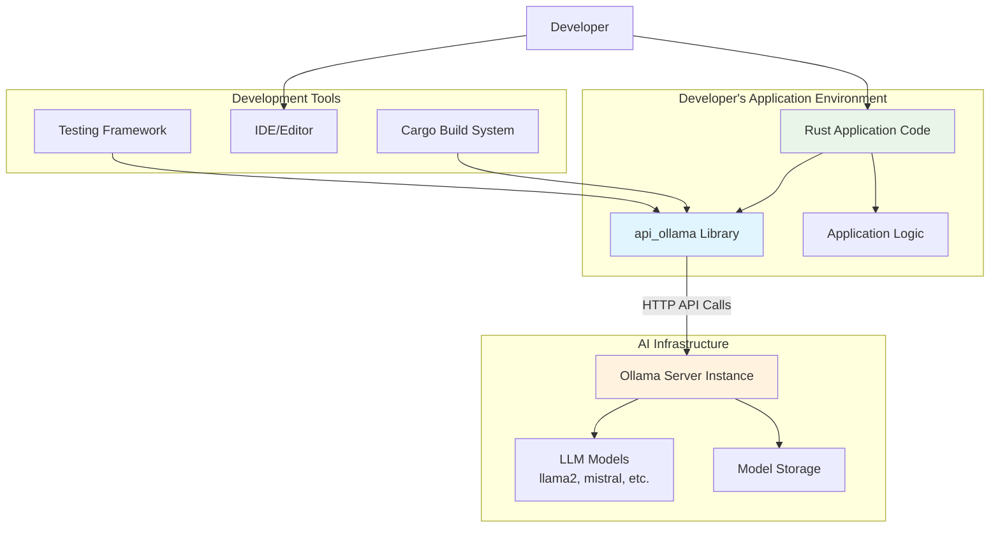
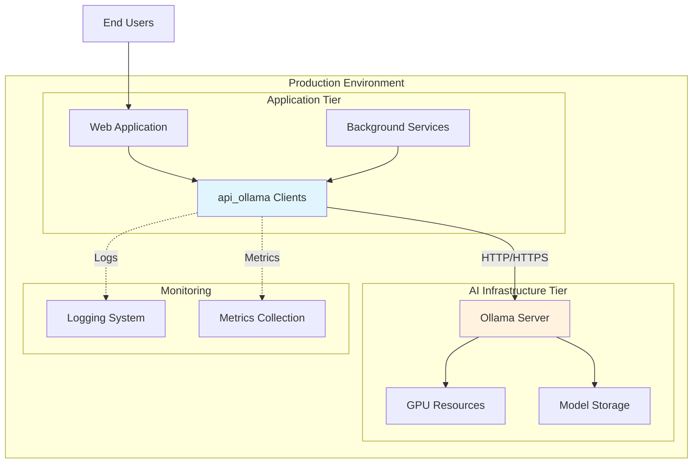
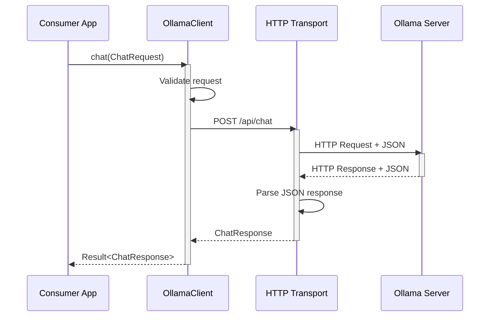
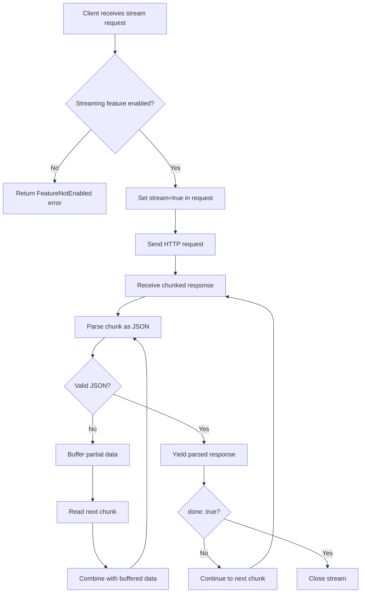
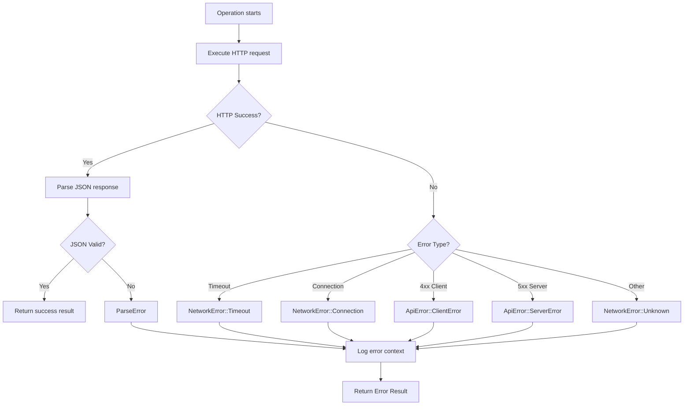
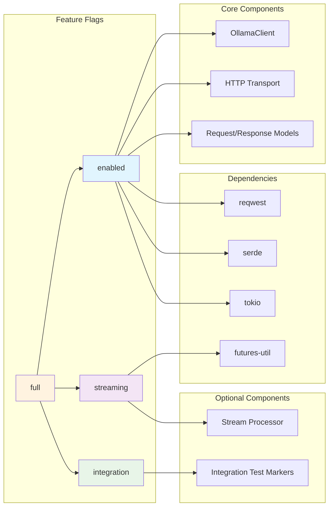
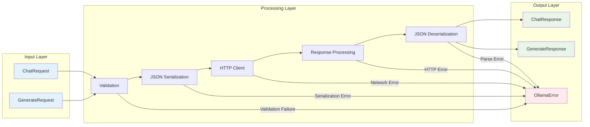

### Part II: Internal Design (Design Recommendations)

*The following sections provide recommended approaches for implementing the public contract defined in Part I. These are flexible guidelines that can be adapted based on implementation needs and constraints.*

### 11. System Architecture

It is recommended that the `api_ollama` library be implemented using a layered architecture with clear separation of concerns and modular components. The following architecture provides a robust foundation while maintaining simplicity and performance.

### Recommended High-Level Architecture

```
┌─────────────────────────────────────────┐
│           Consumer Application          │
└─────────────────┬───────────────────────┘
                  │
┌─────────────────▼───────────────────────┐
│         Public API Layer               │
│  ┌─────────────┐  ┌─────────────────┐   │
│  │ OllamaClient│  │ Builder Pattern │   │
│  └─────────────┘  └─────────────────┘   │
└─────────────────┬───────────────────────┘
                  │
┌─────────────────▼───────────────────────┐
│      Request/Response Processing       │
│  ┌─────────────┐  ┌─────────────────┐   │
│  │ Serializers │  │ Request/Response│   │
│  │   (serde)   │  │     Models      │   │
│  └─────────────┘  └─────────────────┘   │
└─────────────────┬───────────────────────┘
                  │
┌─────────────────▼───────────────────────┐
│         HTTP Transport Layer           │
│  ┌─────────────┐  ┌─────────────────┐   │
│  │   reqwest   │  │  Stream Handler │   │
│  │   Client    │  │  (if streaming) │   │
│  └─────────────┘  └─────────────────┘   │
└─────────────────┬───────────────────────┘
                  │
┌─────────────────▼───────────────────────┐
│           Ollama Server                │
│       (External Dependency)            │
└─────────────────────────────────────────┘
```

### Core Component Design Recommendations

**1. Client Architecture**
It is recommended that the main `OllamaClient` struct follow the builder pattern for construction and maintain minimal state:
- Store only essential configuration (base_url, timeout, http_client)
- Implement `Clone` to enable sharing across async tasks
- Use composition rather than inheritance for extending functionality
- Separate client construction from request execution logic

**2. Request/Response Model Layer**
It is recommended that all API interactions use strongly-typed Rust structs:
- Define separate request/response types for each endpoint
- Use serde attributes for precise JSON field mapping (camelCase conversion)
- Implement `Default` for request types to simplify usage
- Use `Option<T>` for optional fields with `skip_serializing_if` attributes
- Validate critical fields during deserialization where possible

**3. HTTP Transport Abstraction**
It is recommended that HTTP concerns be encapsulated in a dedicated layer:
- Wrap `reqwest::Client` to provide Ollama-specific behavior
- Handle common concerns (timeouts, headers, URL construction) centrally
- Implement consistent error mapping from HTTP to domain errors
- Support both streaming and non-streaming response patterns

**4. Error Handling Strategy**
It is recommended that error handling follow a layered approach:
- Define domain-specific error types at the library boundary
- Map underlying errors (reqwest, serde) to domain errors with context
- Preserve error chains for debugging while providing clear user messages
- Use `error_tools` patterns for consistency with wTools ecosystem

### Streaming Architecture Recommendations

For streaming functionality, it is recommended to implement a separate processing path:
- Use async streams (`futures_core::Stream`) for real-time data flow
- Process chunks incrementally to maintain constant memory usage
- Handle partial JSON objects and reconstruction across chunk boundaries
- Implement proper cleanup and cancellation for interrupted streams
- Use backpressure mechanisms to prevent memory exhaustion

### Implemented Module Organization

The library uses a highly modular structure with feature-gated components to keep lib.rs focused on orchestration and public exports (1,251 lines, under 1,500 line limit):

```
src/
├── lib.rs                    # Public exports, feature gates, mod_interface orchestration (1,251 lines)
├── client.rs                 # OllamaClient struct and core implementation (3,117 lines)
│
├── Core API Types (feature-gated)
├── messages.rs               # Message types for chat (enabled feature)
├── chat.rs                   # Chat request/response types (enabled feature)
├── generate.rs               # Generation request/response types (enabled feature)
├── embeddings.rs             # Embedding request/response types (embeddings feature)
├── models_info.rs            # Model listing types (enabled feature)
├── models_operations.rs      # Model operations (model_details feature)
├── models_enhanced.rs        # Enhanced model metadata (model_details feature)
├── models_additional.rs      # Comprehensive model info (model_details feature)
│
├── Advanced Features (feature-gated)
├── circuit_breaker.rs        # Circuit breaker pattern (circuit_breaker feature) - 314 lines
├── rate_limiter.rs           # Rate limiting (rate_limiting feature) - 434 lines
├── request_cache.rs          # Request caching (request_caching feature) - 547 lines
├── failover.rs               # Failover management (failover feature) - 346 lines
├── diagnostics.rs            # Diagnostics collection (general_diagnostics feature) - 903 lines
├── health_checks.rs          # Health monitoring (health_checks feature) - 629 lines
├── dynamic_config.rs         # Dynamic configuration (dynamic_config feature) - 430 lines
├── sync_api.rs               # Synchronous API wrapper (sync_api feature) - 421 lines
│
├── Specialized Features
├── audio.rs                  # Audio processing types (audio_processing feature)
├── tokens.rs                 # Token counting (count_tokens feature)
├── tuning.rs                 # Model tuning (model_tuning feature)
├── cached_content.rs         # Intelligent caching (cached_content feature)
├── batch_operations.rs       # Batch processing (batch_operations feature)
├── safety_settings.rs        # Content safety (safety_settings feature)
├── websocket.rs              # WebSocket streaming (websocket_streaming feature)
│
├── Supporting Modules
├── auth.rs                   # Authentication (secret_management, workspace features)
├── workspace.rs              # Workspace configuration (workspace feature)
├── enhanced_retry.rs         # Retry logic (retry feature)
├── streaming_control.rs      # Stream control (streaming_control feature)
└── models.rs                 # Backward compatibility shim
```

### Module Extraction Pattern

All extracted modules follow the `mod_interface` pattern for controlled exports:

```rust
// Module structure (e.g., circuit_breaker.rs)
#[ cfg( feature = "circuit_breaker" ) ]
mod private
{
  // All implementation inside private module
  pub struct CircuitBreaker { /* ... */ }
  impl CircuitBreaker { /* ... */ }
}

#[ cfg( feature = "circuit_breaker" ) ]
crate::mod_interface!
{
  exposed use private::CircuitBreaker;
  exposed use private::CircuitBreakerConfig;
  // Controlled public exports
}
```

This pattern ensures:
- Feature-gated compilation (only included when feature enabled)
- Controlled public API surface (via mod_interface macro)
- Clear separation between public and private implementation
- Consistent module organization across the codebase

### File Size Management

To prevent future violations of the 1,500-line limit for lib.rs:

1. **Core principle**: lib.rs should only contain:
   - Feature gate declarations
   - Module declarations
   - Public re-exports via mod_interface
   - Minimal orchestration code

2. **When to extract**: Extract impl blocks or types when:
   - lib.rs approaches 1,000 lines (SHOULD limit)
   - A feature-gated section exceeds 300 lines
   - A logical component can be independently tested

3. **Client extension pattern**: For extending OllamaClient:
   ```rust
   // src/client_ext_feature.rs
   #[ cfg( feature = "feature_name" ) ]
   use crate::client::OllamaClient;

   #[ cfg( feature = "feature_name" ) ]
   impl OllamaClient {
     // Feature-specific methods
   }
   ```

4. **Module extraction checklist**:
   - Create feature-gated module with `mod private {}`
   - Move types/impls to private module
   - Add `mod_interface!` exports
   - Add module declaration in lib.rs
   - Update imports in lib.rs private module
   - Remove original code from lib.rs
   - Verify compilation with all features
   - Run tests to ensure no breakage

### Configuration and Extensibility

It is recommended that the library provide multiple configuration approaches:
- Default configuration for common use cases (localhost development)
- Builder pattern for custom configuration (production deployments)
- Environment variable support for containerized environments
- Custom HTTP client injection for advanced networking requirements

### Performance Optimization Recommendations

To meet the performance requirements, it is recommended to:
- Reuse HTTP connections through connection pooling (reqwest default behavior)
- Use efficient JSON parsing with serde's zero-copy deserialization where possible
- Implement request pipelining for multiple concurrent operations
- Cache serialized request bodies for repeated identical requests
- Use streaming processing to reduce memory footprint for large responses

### Testing Architecture Integration

The architecture should support comprehensive testing through:
- Dependency injection points for mock HTTP clients in unit tests
- Clear boundaries between components to enable isolated testing
- Integration test hooks that work with real Ollama server instances
- Feature-gated integration tests that don't impact production builds

### 12. Rust Library Design: Granular Feature Gating

The `api_ollama` library **must** be designed with a granular feature-gating strategy to allow consumers to opt-in to only the functionality they need. This approach significantly benefits consumers by minimizing their dependency graph, reducing final binary sizes, and speeding up compile times.

### Principle: Disable-by-Default Architecture

The library **must** follow a disable-by-default philosophy where the minimal build contains only the absolute essential functionality. All optional capabilities **must** be gated behind explicit feature flags.

### Required Feature Flag Structure

**1. Core Control Features**
```toml
[features]
# Conservative defaults - users opt-in to only what they need
default = []

# Full feature set for comprehensive functionality  
full = ["enabled", "streaming", "integration", "authentication", "advanced", "workspace"]

# Master switch for core library functionality
enabled = [
  "dep:reqwest",
  "dep:serde", 
  "dep:serde_json",
  "dep:tokio",
  "dep:futures-core",
  "error_tools/enabled"
]
```

**2. Functional Features**
```toml
# Real-time streaming response support
streaming = [
  "enabled",
  "dep:futures-util"
]

# Integration testing with real Ollama servers  
integration = [
  "enabled"
]

# Development and debugging utilities
diagnostics = [
  "enabled",
  "dep:serde_yaml"  # For request/response debugging output
]

# Authentication and security features
authentication = [
  "enabled"
]

# Advanced production features
advanced = [
  "enabled",
  "dep:tokio-util"  # For rate limiting and retry logic
]

# Workspace integration features
workspace = [
  "enabled",
  "dep:serde_yaml",      # For workspace config file parsing
  "dep:workspace_tools"  # For workspace path resolution and secret management
]
```

### Implementation Requirements

**1. Minimal Core Build**
With no features enabled, the library **must** compile to a minimal no-op implementation:
- All public APIs present but return immediate errors indicating feature not enabled
- Zero runtime dependencies beyond Rust standard library
- Compile time under 5 seconds on modern hardware
- Binary size contribution under 50KB

**2. Conditional Compilation Strategy**
All feature-dependent code **must** use conditional compilation:
```rust
// Core client always available but functionality gated
impl OllamaClient {
    #[cfg(feature = "enabled")]
    pub async fn chat(&self, request: ChatRequest) -> OllamaResult<ChatResponse> {
        // Implementation here
    }
    
    #[cfg(not(feature = "enabled"))]
    pub async fn chat(&self, request: ChatRequest) -> OllamaResult<ChatResponse> {
        Err(OllamaError::FeatureNotEnabled("chat requires 'enabled' feature".to_string()))
    }
}

// Streaming methods only exist when feature is enabled
#[cfg(feature = "streaming")]
impl OllamaClient {
    pub async fn chat_stream(&self, request: ChatRequest) -> OllamaResult<impl Stream<Item = OllamaResult<ChatResponse>>> {
        // Streaming implementation
    }
}
```

**3. Dependency Management**
All external dependencies **must** be optional and activated only by relevant features:
```toml
[dependencies]
# All dependencies optional by default
reqwest = { workspace = true, features = ["json", "stream"], optional = true }
serde = { workspace = true, features = ["derive"], optional = true }
serde_json = { workspace = true, optional = true }
tokio = { workspace = true, features = ["time"], optional = true }
futures-core = { workspace = true, optional = true }
futures-util = { workspace = true, optional = true }
error_tools = { workspace = true, optional = true }
workspace_tools = { workspace = true, features = ["secret_management"], optional = true }

[dev-dependencies]
# Development dependencies don't contribute to consumer builds
tokio-stream = { workspace = true }
```

### Feature Interaction Matrix

| Feature Combination | Dependencies Included | Functionality Available |
|---------------------|----------------------|-------------------------|
| `[]` (none) | std only | Error stubs only |
| `["enabled"]` | reqwest, serde, tokio | Core HTTP client |
| `["enabled", "streaming"]` | + futures-util | + Real-time streams |
| `["enabled", "integration"]` | Same as enabled | + Integration test markers |
| `["full"]` | All dependencies | Complete functionality |

### Documentation Requirements

The library's documentation **must** clearly explain:
- Default feature set and how to customize it
- Each feature's purpose and dependency impact
- Examples showing minimal feature usage
- Migration path between feature configurations

**Example Documentation Section**:
```rust
//! # Feature Flags
//!
//! This crate uses feature flags to enable optional functionality:
//!
//! - `enabled` (included in `default`): Core HTTP client functionality
//! - `streaming` (included in `default`): Real-time streaming response support  
//! - `integration`: Markers for integration tests (no runtime dependencies)
//! - `full` (default): All features enabled
//!
//! ## Minimal Usage
//! ```toml
//! [dependencies]
//! api_ollama = { version = "0.1", default-features = false, features = ["enabled"] }
//! ```
```

### Rationale and Benefits

This granular feature gating approach provides:

1. **Reduced Compilation Time**: Consumers building without streaming avoid futures-util compilation
2. **Smaller Binary Size**: Minimal builds exclude streaming infrastructure code
3. **Dependency Flexibility**: Consumers can avoid version conflicts with unused dependencies  
4. **Testing Efficiency**: Integration tests don't force production dependency requirements
5. **Ecosystem Compatibility**: Follows established patterns from other wTools crates

The architecture ensures that simple use cases remain lightweight while complex applications can opt-in to full functionality as needed.

### 13. Infrastructure Support

This section compares deployment options for applications using the `api_ollama` library, ranging from minimal development setups to production-scale deployments.

### Deployment Option A: Budget Development Setup

**Target Scenario**: Local development, prototyping, and small-scale applications with minimal infrastructure requirements.

**Configuration Characteristics**:
- Single `OllamaClient` instance per application
- Default timeout settings (120 seconds)
- Basic error handling with standard logging
- Minimal feature set (`enabled` only, no streaming)
- Local Ollama server on same machine

**Resource Requirements**:
- CPU: Single core sufficient for client overhead
- Memory: <10MB additional memory usage for client
- Network: Local TCP connections (no external dependencies)
- Storage: No persistent storage requirements

**Cost Profile**: $0 recurring costs for HTTP client (infrastructure costs depend on Ollama server hosting)

**Limitations Inherited from This Setup**:
- Single-threaded request processing (no concurrent requests)
- Basic error handling without advanced retry logic
- No streaming response support
- Limited to localhost Ollama server connectivity

### Deployment Option B: Production-Scale Setup

**Target Scenario**: Production applications with high availability, scalability, and advanced monitoring requirements.

**Configuration Characteristics**:
- Multiple `OllamaClient` instances with load balancing
- Custom timeout configuration per use case
- Comprehensive error handling with structured logging
- Full feature set including streaming support
- Remote Ollama server with network optimization
- Advanced HTTP client configuration (custom headers, proxy support)

**Resource Requirements**:
- CPU: Multi-core recommended for concurrent request handling
- Memory: ~50MB for connection pooling and stream buffers
- Network: Optimized TCP connections with keep-alive
- Monitoring: Integration with observability platforms

**Advanced Capabilities**:
- Support for 100+ concurrent requests per client instance
- Streaming response processing with backpressure handling
- Advanced error recovery and circuit breaker patterns (application-level)
- Performance monitoring and metrics collection
- Integration with production logging and tracing systems

**Scalability Characteristics**:
- Horizontal scaling through multiple client instances
- Connection pool optimization for reduced latency
- Stream processing with configurable buffer sizes
- Advanced timeout and retry strategies

### Deployment Comparison Matrix

| Aspect | Budget Development | Production-Scale |
|--------|-------------------|------------------|
| **Concurrent Requests** | 1-10 requests | 100+ concurrent |
| **Features** | Basic client only | Full feature set |
| **Error Handling** | Basic errors | Comprehensive with context |
| **Monitoring** | Console logging | Structured metrics |
| **Network Optimization** | Default settings | Custom configuration |
| **Scalability** | Single instance | Multiple instances |
| **Operational Complexity** | Minimal | Advanced configuration |

### Infrastructure Decision Framework

**Choose Budget Setup When**:
- Developing locally or prototyping
- Single-user applications or internal tools
- Minimal concurrent request requirements
- Simple error handling sufficient

**Choose Production Setup When**:
- Multi-user production applications
- High concurrent request volumes
- Advanced monitoring and observability required
- Streaming response processing needed
- Remote Ollama server deployment

This infrastructure analysis helps developers select the appropriate deployment approach based on their specific requirements and constraints.

### 14. Data Stores

This section identifies the data stores and access patterns for the `api_ollama` library. As an HTTP client library, the data storage requirements are minimal and focused on configuration and transient request/response data.

### Primary Data Access Patterns

The library operates primarily with transient data flows and requires no persistent storage mechanisms. The following data access patterns are recommended:

| Data Store | Type | Access Pattern | Purpose |
|------------|------|----------------|---------|
| **Client Configuration** | In-Memory Struct | Read-Only | Store base URL, timeout, HTTP client settings |
| **Request Models** | In-Memory Struct | Write-Once/Read-Once | Serialize user input to JSON for API calls |
| **Response Models** | In-Memory Struct | Write-Once/Read-Many | Deserialize API responses for user consumption |
| **HTTP Connection Pool** | In-Memory (reqwest) | Read/Write | Reuse connections for performance optimization |
| **Stream Buffers** | In-Memory Queue | Read/Write/Stream | Buffer streaming response chunks during processing |
| **Error Context** | In-Memory Struct | Write-Once/Read-Once | Capture error details and context for debugging |

### Configuration Data Management

It is recommended that client configuration be managed through immutable structures:

**Configuration Storage Pattern**:
- Store configuration in `OllamaClient` struct fields
- Use `Arc<>` wrapping for shared configuration across async tasks  
- Implement `Clone` for lightweight configuration sharing
- Validate configuration at construction time, not at request time

**Recommended Configuration Schema**:
```rust
#[derive(Debug, Clone)]
pub struct ClientConfig {
    pub base_url: String,           // Ollama server endpoint
    pub timeout: Duration,          // Request timeout duration
    pub http_client: reqwest::Client, // HTTP client instance
}
```

### Request/Response Data Flow

The library should implement a stateless data flow pattern for API interactions:

**Request Processing Flow**:
1. **Input Validation**: Validate user-provided request structures
2. **Serialization**: Convert Rust structs to JSON using serde
3. **HTTP Transmission**: Send JSON payload via reqwest
4. **Response Capture**: Receive HTTP response and extract body
5. **Deserialization**: Convert JSON response to Rust structs
6. **Error Mapping**: Transform HTTP/parsing errors to domain errors

**Recommended Data Lifetime Management**:
- Request data: Lives only for the duration of the API call
- Response data: Owned by caller, no internal caching or persistence
- Error data: Includes full context chain but does not persist beyond error handling
- Stream data: Processed incrementally with bounded memory usage

### Memory Management Strategy

It is recommended that the library implement the following memory management patterns:

**For Non-Streaming Operations**:
- Use owned data structures (`String`, `Vec<T>`) for simplicity and safety
- Avoid unnecessary cloning through strategic use of references
- Rely on Rust's automatic memory management for cleanup
- Size limits enforced at HTTP layer to prevent excessive allocations

**For Streaming Operations** (when streaming feature enabled):
- Maintain fixed-size buffers (recommended: 64KB chunks)
- Process data incrementally to avoid accumulating large responses in memory  
- Use `futures::Stream` abstractions for backpressure management
- Implement proper cleanup for interrupted or failed streams

### Caching and Persistence Constraints

The library explicitly **does not** implement persistent data storage:

**No Persistent Storage**:
- No response caching mechanisms
- No request deduplication or replay storage  
- No session or authentication token persistence
- No configuration file reading or writing

**Rationale for Stateless Design**:
- Simplifies library architecture and reduces complexity
- Avoids file system permissions and storage location concerns
- Enables easy integration into various application architectures
- Reduces security surface area (no data persistence vulnerabilities)
- Maintains focus on core HTTP client functionality

### Thread Safety and Concurrent Access

It is recommended that data access be designed for concurrent usage:

**Thread-Safe Patterns**:
- Client configuration stored in `Arc<ClientConfig>` for shared access
- HTTP client (`reqwest::Client`) is inherently thread-safe and shareable
- Request/response data owned by individual async tasks (no sharing required)
- Error handling uses owned data structures to avoid lifetime complexities

**Concurrency Considerations**:
- Multiple async tasks can share a single `OllamaClient` instance safely
- Each API call operates on independent request/response data
- Stream processing maintains isolation between concurrent streams
- No global mutable state that would require synchronization primitives

### Data Validation and Integrity

The library should implement validation at appropriate boundaries:

**Input Validation**:
- Validate base URLs during client construction
- Validate required fields in request structures
- Enforce reasonable limits on request sizes and parameter values
- Provide clear error messages for validation failures

**Response Validation**:
- Verify JSON structure matches expected response schemas
- Handle missing or null fields gracefully using `Option<T>`
- Validate response completeness for streaming operations
- Map malformed responses to appropriate error types

This stateless, validation-focused approach ensures the library remains lightweight while providing robust error handling and thread-safe operation patterns.

### 15. Architectural & Flow Diagrams

This section provides visual representations of the library's architecture and key operational flows using Mermaid diagrams for version-controllable documentation.

### System Context Diagram

The following diagram shows how the `api_ollama` library fits within the broader application ecosystem:



### Deployment Architecture Diagram  

This diagram illustrates common deployment patterns for applications using the library:



### High-Level Architecture Diagram

The following diagram illustrates the overall system structure and component relationships:

```mermaid
graph TD
    subgraph "Consumer Application"
        A[Rust Application Code]
    end

    subgraph "api_ollama Library"
        B[OllamaClient]
        C[Builder Pattern]
        D[Request Models]
        E[Response Models]
        F[HTTP Transport]
        G[Error Handler]
        H[Stream Processor]
    end

    subgraph "External Dependencies"
        I[reqwest HTTP Client]
        J[serde JSON Parser]
        K[tokio Runtime]
    end

    subgraph "Ollama Server"
        L[/api/chat]
        M[/api/generate]
        N[/api/tags]
        O[/api/show]
    end

    A --> B
    A --> C
    C --> B
    B --> D
    B --> E
    B --> F
    B --> G
    F --> H
    
    F --> I
    D --> J
    E --> J
    G --> J
    H --> K
    
    I --> L
    I --> M
    I --> N
    I --> O
```

### Chat Completion Sequence Diagram

This diagram shows the complete flow for a chat completion request:



### Streaming Response Flow Diagram

This diagram illustrates the streaming response processing pattern:



### Error Handling Flow Diagram

This diagram shows the error categorization and handling process:



### Feature Gating Architecture Diagram

This diagram illustrates how feature flags control compilation and functionality:



### Data Flow Architecture

This diagram shows how data moves through the library components:



### Diagram Usage Guidelines

Each diagram serves a specific purpose in understanding the library architecture:

- **System Context**: Shows library's role in broader application ecosystem for stakeholders
- **Deployment Architecture**: Illustrates common production deployment patterns  
- **High-Level Architecture**: Provides overview of system boundaries and major components
- **Chat Completion Sequence**: Details the most common usage pattern step-by-step
- **Streaming Response Flow**: Explains the complex streaming processing logic
- **Error Handling Flow**: Documents the comprehensive error categorization strategy
- **Feature Gating Architecture**: Shows how compilation features control functionality
- **Data Flow Architecture**: Illustrates request/response processing pipeline

These diagrams should be maintained as the implementation evolves to ensure documentation remains synchronized with the actual codebase structure.

### 16. Internal Data Models

This section defines the recommended internal data structures and their relationships for implementing the `api_ollama` library. These models serve as the foundation for type-safe API interactions and robust error handling.

### Core Client Data Models

**Client Configuration Model**
```rust
/// Internal configuration structure for OllamaClient
#[derive(Debug, Clone)]
pub struct ClientConfig {
    /// Base URL for Ollama server (e.g., "http://localhost:11434")
    pub base_url: String,
    /// Request timeout duration
    pub timeout: Duration,
    /// Shared HTTP client instance
    pub http_client: Arc<reqwest::Client>,
}

impl Default for ClientConfig
{
  fn default() -> Self
  {
    Self
    {
      base_url: "http://localhost:11434".to_string(),
      timeout: Duration::from_secs( 120 ),
      http_client: Arc::new( reqwest::Client::new() ),
    }
  }
}
```

**Client Builder Model**
```rust
/// Builder for constructing OllamaClient instances
#[derive(Debug)]
pub struct ClientBuilder {
    base_url: String,
    timeout: Duration,
    custom_client: Option<reqwest::Client>,
}
```

### Request/Response Data Models

**Common Message Model**
```rust
/// A message in a chat conversation
#[derive(Debug, Clone, Serialize, Deserialize)]
pub struct Message {
    /// Role of the message sender (e.g., "user", "assistant")
    pub role: String,
    /// Content of the message
    pub content: String,
}

impl Message
{
  pub fn user( content: impl Into< String > ) -> Self
  {
    Self
    {
      role: "user".to_string(),
      content: content.into()
    }
  }

  pub fn assistant( content: impl Into< String > ) -> Self
  {
    Self
    {
      role: "assistant".to_string(),
      content: content.into()
    }
  }
}
```

**Chat API Models**
```rust
/// Request structure for chat completion
#[derive(Debug, Serialize, Default)]
pub struct ChatRequest {
    /// Model name to use for completion
    pub model: String,
    /// Messages in the conversation
    pub messages: Vec<Message>,
    
    #[serde(skip_serializing_if = "Option::is_none")]
    /// Whether to stream the response
    pub stream: Option<bool>,
    
    #[serde(skip_serializing_if = "Option::is_none")]
    /// Additional model parameters
    pub options: Option<serde_json::Value>,
}

/// Response structure for chat completion
#[derive(Debug, Deserialize)]
pub struct ChatResponse {
    #[serde(default)]
    /// Generated message from the model
    pub message: Option<Message>,
    
    #[serde(default)]
    /// Whether generation is complete
    pub done: bool,
    
    #[serde(default)]
    /// Total time taken for generation in nanoseconds
    pub total_duration: Option<u64>,
    
    #[serde(default)]
    /// Number of tokens in the prompt
    pub prompt_eval_count: Option<u32>,
    
    #[serde(default)]
    /// Number of tokens generated
    pub eval_count: Option<u32>,
}
```

**Generation API Models**
```rust
/// Request structure for text generation
#[derive(Debug, Serialize, Default)]
pub struct GenerateRequest {
    /// Model name to use for generation
    pub model: String,
    /// Text prompt for generation
    pub prompt: String,
    
    #[serde(skip_serializing_if = "Option::is_none")]
    /// Whether to stream the response
    pub stream: Option<bool>,
    
    #[serde(skip_serializing_if = "Option::is_none")]
    /// Additional model parameters
    pub options: Option<serde_json::Value>,
}

/// Response structure for text generation
#[derive(Debug, Deserialize)]
pub struct GenerateResponse {
    #[serde(default)]
    /// Generated text response
    pub response: String,
    
    #[serde(default)]
    /// Whether generation is complete
    pub done: bool,
    
    #[serde(default)]
    /// Total time taken for generation in nanoseconds
    pub total_duration: Option<u64>,
    
    #[serde(default)]
    /// Number of tokens in the prompt
    pub prompt_eval_count: Option<u32>,
    
    #[serde(default)]
    /// Number of tokens generated
    pub eval_count: Option<u32>,
}
```

**Model Management Data Models**
```rust
/// Information about a specific model
#[derive(Debug, Deserialize)]
pub struct ModelInfo {
    /// Name of the model
    pub name: String,
    /// Size of the model in bytes
    pub size: u64,
    /// SHA256 digest of the model
    pub digest: String,
    /// Timestamp when the model was last modified
    pub modified_at: String,
}

/// Response from listing available models
#[derive(Debug, Deserialize)]
pub struct TagsResponse {
    /// List of available models
    pub models: Vec<ModelInfo>,
}
```

### Error Data Models

**Primary Error Enumeration**
```rust
/// Comprehensive error types for Ollama API operations
#[derive(Debug)]
pub enum OllamaError {
    /// Network-related errors (connection, timeout, etc.)
    NetworkError(NetworkErrorDetails),
    
    /// JSON parsing or serialization errors
    ParseError(ParseErrorDetails),
    
    /// API-specific errors with HTTP status codes
    ApiError(ApiErrorDetails),
    
    /// Streaming-related errors
    #[cfg(feature = "streaming")]
    StreamError(StreamErrorDetails),
    
    /// Feature not enabled error
    FeatureNotEnabled(String),
}

#[derive(Debug)]
pub struct NetworkErrorDetails {
    pub kind: NetworkErrorKind,
    pub message: String,
    pub source: Option<Box<dyn std::error::Error + Send + Sync>>,
}

#[derive(Debug)]
pub enum NetworkErrorKind {
    Connection,
    Timeout,
    Dns,
    Unknown,
}

#[derive(Debug)]
pub struct ApiErrorDetails {
    pub status_code: u16,
    pub message: String,
    pub response_body: Option<String>,
}

#[derive(Debug)]
pub struct ParseErrorDetails {
    pub context: String,
    pub source: serde_json::Error,
}

#[cfg(feature = "streaming")]
#[derive(Debug)]
pub struct StreamErrorDetails {
    pub message: String,
    pub position: Option<usize>,
}
```

### Streaming Data Models (Feature Gated)

**Stream Processing Models**
```rust
#[cfg(feature = "streaming")]
/// Internal buffer for streaming response processing
pub(crate) struct StreamBuffer {
    /// Accumulated partial data
    buffer: Vec<u8>,
    /// Current buffer position
    position: usize,
    /// Maximum buffer size (64KB default)
    max_size: usize,
}

#[ cfg( feature = "streaming" ) ]
impl StreamBuffer
{
  pub fn new() -> Self
  {
    Self
    {
      buffer: Vec::with_capacity( 65536 ), // 64KB
      position: 0,
      max_size: 65536,
    }
  }

  pub fn append( &mut self, data: &[ u8 ] ) -> Result< (), OllamaError >
  {
    if self.buffer.len() + data.len() > self.max_size
    {
      return Err
      (
        OllamaError::StreamError
        (
          StreamErrorDetails
          {
            message: "Stream buffer overflow".to_string(),
            position: Some( self.position ),
          }
        )
      );
    }
    self.buffer.extend_from_slice( data );
    Ok( () )
  }
}
```

### Data Model Design Principles

**Serialization Strategy**:
- Use `serde` with `snake_case` to `camelCase` conversion for JSON compatibility
- Implement `Default` for request types to simplify API usage
- Use `Option<T>` with `skip_serializing_if` for optional fields
- Preserve all response fields for future compatibility

**Memory Management**:
- Use owned types (`String`, `Vec<T>`) for simplicity and safety
- Implement `Clone` for data structures that may be shared
- Use `Arc<T>` only for expensive-to-clone shared resources
- Bounded buffers for streaming to prevent memory exhaustion

**Error Context Preservation**:
- Maintain error chains through structured error details
- Include operation context in error messages
- Preserve original error sources for debugging
- Use domain-specific error variants for clear categorization

**Validation and Constraints**:
- Validate required fields during construction where possible
- Use type system to enforce invariants (non-empty strings, valid URLs)
- Implement `Display` for user-friendly error messages
- Provide builder methods for complex data structure construction

These internal data models provide a robust foundation for type-safe, efficient, and maintainable implementation while following Rust best practices and serde conventions.

### 17. Reference Implementation

This section provides high-level workflow guidance for implementing the `api_ollama` library, including recommended patterns for key operations and integration points.

### Client Construction Workflow

It is recommended that client construction follow this pattern:

```rust
// Default construction workflow
pub fn new() -> OllamaResult< OllamaClient >
{
  let config = ClientConfig::default();
  Self::from_config( config )
}

// Builder pattern workflow
pub fn builder() -> ClientBuilder
{
  ClientBuilder::new()
}

// Internal construction from validated config
fn from_config( config: ClientConfig ) -> OllamaResult< OllamaClient >
{
  // Validate base URL format
  url::Url::parse( &config.base_url )
    .map_err( | e | OllamaError::InvalidArgument( format!( "Invalid base URL: {}", e ) ) )?;

  Ok
  (
    OllamaClient
    {
      config: Arc::new( config ),
    }
  )
}
```

### HTTP Request Processing Workflow

The following workflow is recommended for all HTTP operations:

**1. Request Preparation Phase**
```rust
async fn execute_request< T, R >( &self, endpoint: &str, request: &T ) -> OllamaResult< R >
where
  T: Serialize,
  R: for< 'de > Deserialize< 'de >,
{
  // Build complete URL
  let url = format!( "{}/api/{}", self.config.base_url, endpoint );

  // Serialize request to JSON
  let json_body = serde_json::to_string( request )
    .map_err
    (
      | e | OllamaError::ParseError
      (
        ParseErrorDetails
        {
          context: "Failed to serialize request".to_string(),
          source: e,
        }
      )
    )?;

  // Prepare HTTP request with headers
  let http_request = self.config.http_client
    .post( &url )
    .header( "Content-Type", "application/json" )
    .body( json_body )
    .timeout( self.config.timeout );
```

**2. HTTP Execution Phase**
```rust
  // Execute HTTP request with error mapping
  let response = http_request.send().await
    .map_err( | e | self.map_reqwest_error( e ) )?;

  // Check HTTP status code
  if !response.status().is_success()
  {
    return Err
    (
      OllamaError::ApiError
      (
        ApiErrorDetails
        {
          status_code: response.status().as_u16(),
          message: format!( "HTTP {}", response.status() ),
          response_body: response.text().await.ok(),
        }
      )
    );
  }
```

**3. Response Processing Phase**
```rust
  // Extract response body
  let response_text = response.text().await
    .map_err
    (
      | e | OllamaError::NetworkError
      (
        NetworkErrorDetails
        {
          kind: NetworkErrorKind::Unknown,
          message: "Failed to read response body".to_string(),
          source: Some( Box::new( e ) ),
        }
      )
    )?;

  // Deserialize JSON response
  let parsed_response: R = serde_json::from_str( &response_text )
    .map_err
    (
      | e | OllamaError::ParseError
      (
        ParseErrorDetails
        {
          context: format!( "Failed to parse response from {}", endpoint ),
          source: e,
        }
      )
    )?;

  Ok( parsed_response )
}
```

### Streaming Implementation Workflow

For streaming operations, the following pattern is recommended:

```rust
#[ cfg( feature = "streaming" ) ]
pub async fn chat_stream( &self, mut request: ChatRequest ) -> OllamaResult< impl Stream< Item = OllamaResult< ChatResponse > > >
{
  // Force streaming mode
  request.stream = Some( true );

  // Execute streaming HTTP request
  let response = self.execute_streaming_request( "chat", &request ).await?;

  // Create stream processor
  let stream = response.bytes_stream()
    .map( | chunk_result | self.process_stream_chunk( chunk_result ) )
    .filter_map
    (
      | result | async move
      {
        match result
        {
          Ok( Some( response ) ) => Some( Ok( response ) ),
          Ok( None ) => None, // Partial chunk, continue
          Err( e ) => Some( Err( e ) ),
        }
      }
    );

  Ok( Box::pin( stream ) )
}

// Stream chunk processing with buffering
fn process_stream_chunk( &self, chunk_result: Result< Bytes, reqwest::Error > ) -> OllamaResult< Option< ChatResponse > >
{
  let chunk = chunk_result.map_err
  (
    | e | OllamaError::StreamError
    (
      StreamErrorDetails
      {
        message: format!( "Stream chunk error: {}", e ),
        position: None,
      }
    )
  )?;

  // Convert to string and attempt JSON parsing
  let chunk_str = std::str::from_utf8( &chunk )
    .map_err
    (
      | e | OllamaError::StreamError
      (
        StreamErrorDetails
        {
          message: format!( "UTF-8 decode error: {}", e ),
          position: Some( e.valid_up_to() ),
        }
      )
    )?;

  // Handle partial JSON objects (implementation detail)
  self.parse_json_chunk( chunk_str )
}
```

### Error Handling Implementation Pattern

It is recommended that error handling follow a consistent mapping pattern:

```rust
impl OllamaClient
{
  fn map_reqwest_error( &self, error: reqwest::Error ) -> OllamaError
  {
    if error.is_timeout()
    {
      OllamaError::NetworkError
      (
        NetworkErrorDetails
        {
          kind: NetworkErrorKind::Timeout,
          message: format!( "Request timed out after {}s", self.config.timeout.as_secs() ),
          source: Some( Box::new( error ) ),
        }
      )
    }
    else if error.is_connect()
    {
      OllamaError::NetworkError
      (
        NetworkErrorDetails
        {
          kind: NetworkErrorKind::Connection,
          message: format!( "Failed to connect to {}", self.config.base_url ),
          source: Some( Box::new( error ) ),
        }
      )
    }
    else
    {
      OllamaError::NetworkError
      (
        NetworkErrorDetails
        {
          kind: NetworkErrorKind::Unknown,
          message: error.to_string(),
          source: Some( Box::new( error ) ),
        }
      )
    }
  }
}
```

### Feature Gating Implementation Pattern

Conditional compilation should follow this pattern:

```rust
impl OllamaClient
{
  // Core functionality always available when enabled
  #[ cfg( feature = "enabled" ) ]
  pub async fn chat( &self, request: ChatRequest ) -> OllamaResult< ChatResponse >
  {
    self.execute_request( "chat", &request ).await
  }

  // Stub implementation when feature disabled
  #[ cfg( not( feature = "enabled" ) ) ]
  pub async fn chat( &self, _request: ChatRequest ) -> OllamaResult< ChatResponse >
  {
    Err
    (
      OllamaError::FeatureNotEnabled
      (
        "Chat functionality requires 'enabled' feature".to_string()
      )
    )
  }

  // Streaming methods only exist when both features enabled
  #[ cfg( all( feature = "enabled", feature = "streaming" ) ) ]
  pub async fn chat_stream( &self, request: ChatRequest ) -> OllamaResult< impl Stream< Item = OllamaResult< ChatResponse > > >
  {
    // Streaming implementation
  }
}
```

### Testing Integration Points

The implementation should provide hooks for testing:

```rust
impl OllamaClient
{
  // Constructor for testing with custom HTTP client
  #[ cfg( test ) ]
  pub fn with_http_client( base_url: String, client: reqwest::Client ) -> OllamaResult< Self >
  {
    let config = ClientConfig
    {
      base_url,
      timeout: Duration::from_secs( 30 ),
      http_client: Arc::new( client ),
    };
    Self::from_config( config )
  }
}

#[ cfg( all( test, feature = "integration" ) ) ]
mod integration_tests
{
  use super::*;

  #[ tokio::test ]
  async fn test_real_ollama_connection()
  {
    let client = OllamaClient::new().expect( "Failed to create client" );

    // Only run if Ollama server is available
    if !client.is_available().await
    {
      eprintln!( "Skipping integration test: Ollama server not available" );
      return;
    }

    // Test actual API calls
    let models = client.list_models().await.expect( "Failed to list models" );
    assert!( !models.models.is_empty() );
  }
}
```

### Performance Optimization Guidelines

The reference implementation should incorporate these optimizations:

**Connection Reuse**:
- Use a single `reqwest::Client` instance per `OllamaClient`
- Enable HTTP/2 connection multiplexing where supported
- Configure reasonable connection pool limits

**Memory Efficiency**:
- Use streaming deserialization for large responses where possible
- Implement bounded buffers for streaming operations
- Avoid unnecessary string cloning in hot paths

**Error Context Preservation**:
- Maintain error source chains for debugging
- Include operation context in all error messages
- Use structured error types over string-based errors

This reference implementation provides a robust foundation that meets all functional and non-functional requirements while maintaining flexibility for future enhancements.
